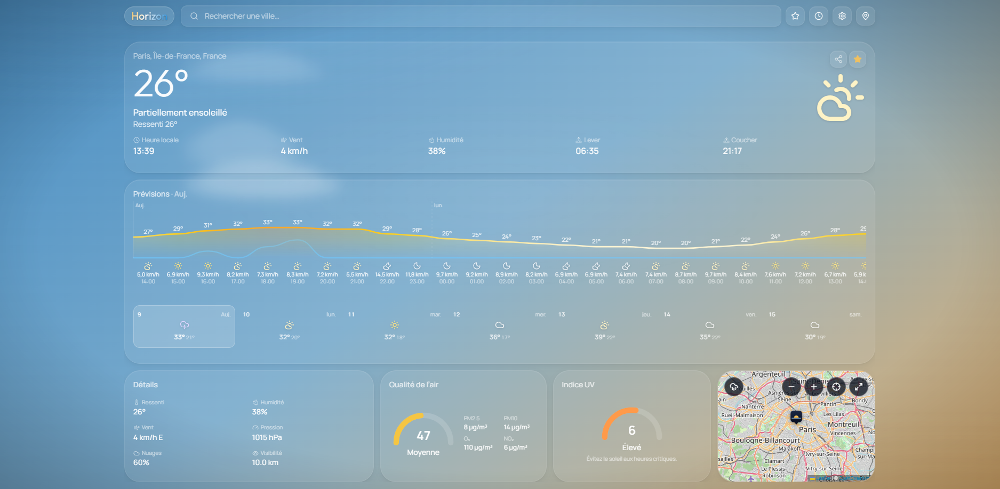
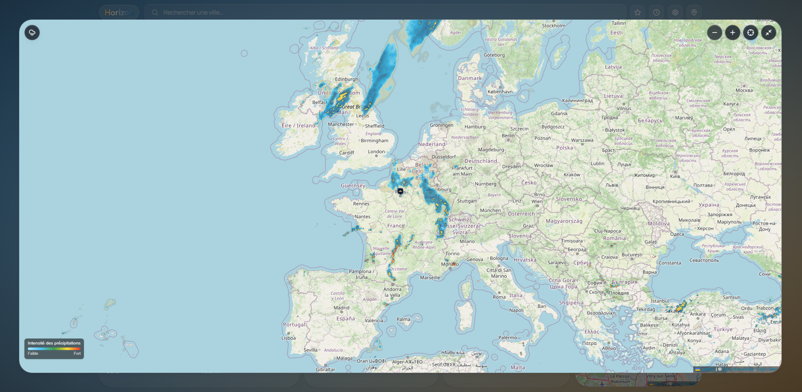

# Horizon

Application météo web: dashboard immersif, prévisions, qualité de l’air et carte interactive avec radar de précipitations.

**Démo :** [horizonmeteo.vercel.app](https://horizonmeteo.vercel.app)

[Déployer sur Vercel](https://vercel.com/new/clone?repository-url=https://github.com/SteveRothier/Horizon) · [Dépôt GitHub](https://github.com/SteveRothier/Horizon)

## Fonctionnalités

- Météo actuelle avec fond et icônes liés aux conditions WMO
- Prévisions horaires et sur 7 jours
- Indices AQI et UV
- Carte OSM : pins favoris, aperçu au clic, radar RainViewer
- Recherche de villes, géolocalisation, favoris et historique (persistance locale)
- Unités °C/°F et km/h·mph, interface FR / EN
- URLs partageables `/weather/[city]`, partage natif / presse-papiers
- PWA installable (manifest + icônes)

## Stack

| Couche | Technologies |
| ------ | ------------ |
| App | Next.js 15 (App Router), React 19, TypeScript |
| UI | Tailwind CSS, Framer Motion, tokens de scènes météo |
| Données client | TanStack Query, Zustand + `localStorage` |
| Carte | Leaflet, react-leaflet, RainViewer |
| APIs | Open-Meteo, Nominatim, OpenWeather (fallback optionnel) |

## Décisions techniques

- **Open-Meteo en premier** — météo, AQI et UV sans clé API ; OpenWeather uniquement en secours optionnel.
- **Radar sur Leaflet** — tuiles RainViewer (gratuites, sans clé) plutôt qu’une migration MapLibre ; `maxNativeZoom` 7 pour rester dans le plafond du tier free.
- **État 100 % client** — favoris, historique et réglages en `localStorage` ; pas d’auth ni de sync cloud.
- **PWA légère** — installable via manifest ; pas de service worker offline-first.
- **Conditions WMO détaillées** — mapping fin pour aligner hero, icônes et fonds sur le ciel réel.

## Aperçu





## Démarrage

```bash
npm install
cp .env.example .env.local
npm run dev
```

Ouvrir [http://localhost:3000](http://localhost:3000).

| Variable | Obligatoire | Description |
| -------- | ----------- | ----------- |
| `OPENWEATHER_API_KEY` | Non | Fallback météo / AQI si Open-Meteo échoue |

Sans cette variable, l’application fonctionne uniquement avec Open-Meteo.

## Architecture

```
UI (dashboard, carte, favoris)
  → TanStack Query  →  /api/weather | /api/geocode | /api/air-quality
  → Zustand         →  localStorage

API routes
  → Nominatim (géocodage)
  → Open-Meteo (current, hourly, daily, UV, AQI)
  → OpenWeather (fallback optionnel)
```

## Scripts

| Commande | Description |
| -------- | ----------- |
| `npm run dev` | Serveur de développement (Turbopack) |
| `npm run build` | Build de production |
| `npm run start` | Serveur de production |
| `npm run lint` | ESLint |
| `npm test` | Vitest (utilitaires et routes API) |

## Déploiement

Importer le dépôt sur [Vercel](https://vercel.com) (framework Next.js détecté automatiquement). Aucun `vercel.json` requis. Définir `OPENWEATHER_API_KEY` seulement si le fallback OpenWeather est souhaité.

Un modèle de workflow GitHub Actions (lint, test, build) est fourni dans [`docs/ci.workflow.yml`](docs/ci.workflow.yml) — à placer sous `.github/workflows/` lorsque le token GitHub dispose du scope `workflow`.

## Licence

Projet portfolio privé, destiné à la démonstration. Tous droits réservés.
